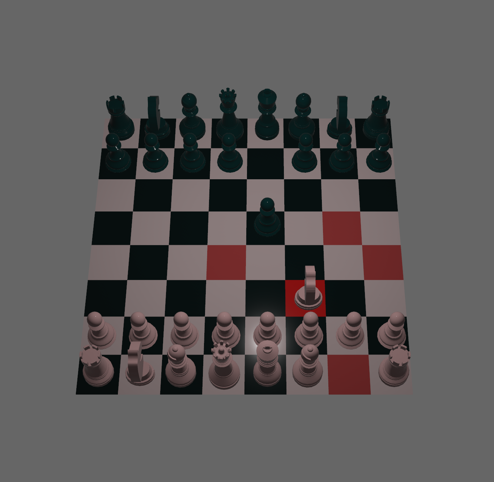

# bevy test

This is a test project for trying out [bevy](https://bevyengine.org/).

I've followed this walk [through](https://caballerocoll.com/blog/bevy-chess-tutorial/) updating it from 0.4 to 0.9.

I reworked how allowed moves are calculated however it's definitely still just an example. If I find time it might be fun to incorporate sunfish as a chess engine.

